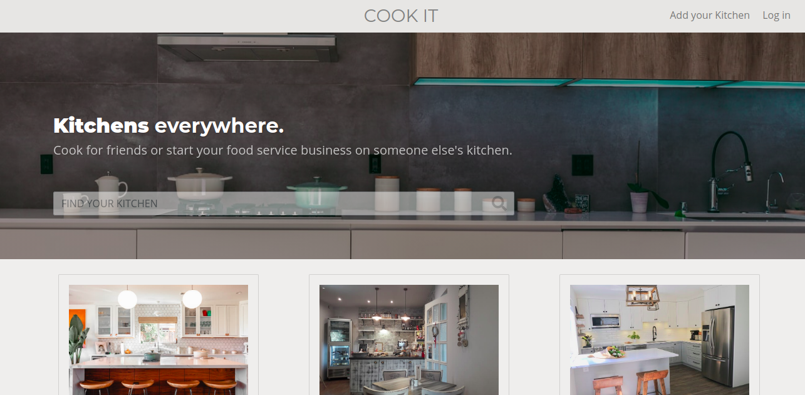

# Rent Your Kitchen App

Project on Rails that allows users to rent out their own kitchens and rent other people kitchens by the hour, similar to AirBnB.

#### [Demo Video](https://marcoscannabrava.github.io/videos/cookit.mp4)

[Link to Heroku](https://cook-it-330-v2.herokuapp.com/)

Project developed @ Le Wagon Bootcamp.

> Screenshot

-------------------------------------

**Features & Gems**
- Login (Devise)
- Authorization (Pundit)
- CRUD
- Date & Time Picker (Datepickr)
- Photo Upload (Carrierwave & Cloudinary)
- Geolocation & Maps (Geocoder)
